# Especificaciones Técnicas — `mcts_decision_hoy.py`

> Herramienta de apoyo a la decisión de trading para antes de la apertura del mercado.  
> Ejecuta MCTS **una sola vez** sobre el estado real de la cartera del usuario.  
> Archivo: `trading/mcts_tsla/mcts_decision_hoy.py`

---

## 1. Flujo de ejecución



---

## 2. Especificaciones técnicas

### 2.1 Parámetros de usuario (los únicos que se deben modificar)

| Parámetro | Tipo | Descripción | Ejemplo |
|---|---|---|---|
| `TU_EFECTIVO` | `float` | Dinero disponible en cuenta (USD) | `5_000.0` |
| `TUS_ACCIONES` | `float` | Nº de acciones de TSLA en cartera | `3.5` |

El resto de parámetros se heredan directamente de `mcts_simple.py`:

| Parámetro heredado | Valor | Rol en este script |
|---|---|---|
| `TICKER` | `"TSLA"` | Activo sobre el que se decide |
| `PERIOD` | `"2y"` | Período histórico para calibrar GBM |
| `ITERACIONES` | `1 000` | Nº de simulaciones Monte Carlo |
| `DIAS_ROLLOUT` | `60` | Horizonte de cada simulación (días) |
| `VENTANA_CALIB` | `60` | Ventana rolling para estimar µ y σ |
| `SEMILLA` | `42` | Reproducibilidad diaria |
| `ACCIONES` | 11 acciones | Espacio de decisión completo |

### 2.2 Diferencias respecto a `mcts_simple.py`

| Aspecto | `mcts_simple.py` | `mcts_decision_hoy.py` |
|---|---|---|
| **Propósito** | Backtest histórico completo | Decisión única para hoy |
| **Nº de ejecuciones MCTS** | Una por día (T-1 total) | Una sola (sobre el día actual) |
| **Estado raíz** | Reconstruido para cada día del backtest | Estado real del usuario: su efectivo y acciones actuales |
| **Precio usado** | Precios históricos reales | Último precio de cierre disponible (ayer) |
| **Salida principal** | 3 gráficos PNG + métricas | Recomendación en consola + 2 gráficos PNG |
| **Convergencia UCB** | Solo en el día central del backtest | Siempre (registrar_convergencia=True) |

### 2.3 Estado raíz s₀

```
s₀ = crear_estado(
  dia          = len(precios) - 1,   ← último día disponible (ayer)
  efectivo     = TU_EFECTIVO,        ← cartera real del usuario
  acciones     = TUS_ACCIONES,       ← cartera real del usuario
  precio       = precios[-1],        ← precio de cierre de ayer
  precios_hist = precios,            ← serie completa para calcular RSI y MA20
)

RSI(14)  → señal de sobrecompra/sobreventa
MA(20)   → señal de tendencia de corto plazo

Valor total = TU_EFECTIVO + TUS_ACCIONES × precio_ayer
```

### 2.4 Dependencias entre funciones



### 2.5 Pseudocódigo del flujo principal

```
decision_hoy(efectivo, num_acciones):

  # 1. Obtener datos históricos (rol dual: calibrar GBM + inicializar estado)
  precios  = descargar_precios(TICKER, PERIOD)
  dia_hoy  = len(precios) - 1           ← índice del último dato disponible

  # 2. Construir nodo raíz con la cartera real del usuario
  s₀ = {
    dia      : dia_hoy,
    efectivo : efectivo,                 ← TU_EFECTIVO
    acciones : num_acciones,             ← TUS_ACCIONES
    precio   : precios[dia_hoy],         ← precio cierre ayer
    rsi      : RSI(precios, dia_hoy, 14),
    ma20     : MA(precios, dia_hoy, 20),
  }

  # 3. Ejecutar MCTS con registro completo de convergencia
  rng = Generator(seed=SEMILLA)          ← reproducible
  a*, historial = ejecutar_mcts(s₀, precios, rng, registrar_convergencia=True)
  # historial[a] = [Q(a)/N(a) tras iter 1, ..., tras iter K]

  # 4. Calcular ranking final
  medias  = { a: historial[a][-1] for a in historial }
  ranking = sort(medias, descending=True)

  # 5. Imprimir recomendación
  print ranking con barras proporcionales y ◄ ELEGIDA sobre a*
  print interpretación concreta: importe en $ y nº acciones

  # 6. Generar visualizaciones
  graficar_convergencia_ucb(historial)   → mcts_convergencia_hoy.png
  _graficar_ranking(ranking, a*)         → mcts_ranking_acciones.png
```

### 2.6 Interpretación de la salida en consola

```
====================================================
  ESTADO DE CARTERA — TSLA  (cierre de ayer)
====================================================
  Precio cierre ayer  :     245.50 $
  Efectivo disponible :  10,000.00 $
  Acciones en cartera :       0.00
  Valor posición      :       0.00 $
  Valor total         :  10,000.00 $
  RSI (14d)           :      65.3      ← zona neutral (30-70)
  MA20                :     240.25 $
  RSI → zona neutral (no es sobreventa ni sobrecompra)
  MA  → precio SOBRE MA20 — tendencia alcista
====================================================

  Acción          Reward vs B&H    Señal
  ------------------------------------------
  COMPRAR_25         +0.00150      ████░░░░  ◄ ELEGIDA
  MANTENER           +0.00020      ██░░░░░░
  VENDER_10          -0.00050      █░░░░░░░

====================================================
  RECOMENDACIÓN PARA HOY: COMPRAR_25
  → Invertir aprox. 2,500.00 $ (10.20 acciones a 245.50$)
====================================================
```

**Columna `Reward vs B&H`:** Q(a)/N(a) — recompensa media estimada relativa al benchmark Buy & Hold.
- `> 0` → la acción genera alfa positivo (supera al inversor pasivo)
- `< 0` → la acción destruye valor respecto a no operar
- La barra de bloques es proporcional al valor relativo entre todas las acciones

---

## 3. Árbol MCTS en concreto para este script

A diferencia del backtest, aquí el árbol se construye **una sola vez** sobre el estado real del usuario.



### Estructura del árbol tras K iteraciones

```
Raíz s₀ (n = K)
├── COMPRAR_25   (n ≈ 90, w/n = +0.00150)  ← a* elegida
├── MANTENER     (n ≈ 85, w/n = +0.00020)
├── COMPRAR_10   (n ≈ 80, w/n = +0.00010)
├── COMPRAR_50   (n ≈ 75, w/n = -0.00030)
├── VENDER_10    (n ≈ 70, w/n = -0.00050)
│   └── ...       (profundidad 2 si ITERACIONES es grande)
└── ...
```

Nodos con `n` alto son ramas que el árbol exploró más (alta UCT en iteraciones tempranas).  
La decisión final usa `c = 0` (sin exploración): solo importa Q(a)/N(a).

---

## 4. Visualizaciones generadas

| Archivo | Contenido | Cómo leerlo |
|---|---|---|
| `mcts_convergencia_hoy.png` | Q(a)/N(a) vs nº de iteración para cada acción | Las curvas deben estabilizarse antes de K. Si aún oscilan al final, aumentar ITERACIONES |
| `mcts_ranking_acciones.png` | Barras horizontales con Q(a)/N(a) de cada acción | Eje X = 0 es el benchmark B&H. La barra con borde naranja es a*. A la derecha del 0 = alfa positivo |

---

## 5. Formulario matemático

Este script **hereda todas las fórmulas de `mcts_simple.py`** sin modificaciones (importa directamente `ejecutar_mcts`, `rollout`, `calibrar_gbm`, etc.). Las fórmulas completas con definición de variables están en [`mcts_simple_especificaciones.md` — Sección 5](mcts_simple_especificaciones.md#5-formulario-matemático).

A continuación se documentan únicamente los dos elementos específicos de este script.

### 5.1 Variables propias

| Símbolo | Tipo | Descripción |
|---|---|---|
| $E_0$ | $\mathbb{R}_{\ge 0}$ | `TU_EFECTIVO` — efectivo disponible en cuenta (USD) |
| $h_0$ | $\mathbb{R}_{\ge 0}$ | `TUS_ACCIONES` — acciones del activo en cartera |
| $P_{\text{ayer}}$ | $\mathbb{R}_{>0}$ | Último precio de cierre disponible (día $t = T-1$) |
| $a^*$ | $\mathcal{A}$ | Acción recomendada — argmax de $Q(a)/N(a)$ |
| $f_a$ | $[0,1]$ | Fracción de cartera que mueve la acción $a$ (`_FRACCION_ACCION`) |

### 5.2 Estado raíz con cartera real

$$s_0 = \bigl(t_{\text{hoy}},\; E_0,\; h_0,\; P_{\text{ayer}},\; RSI_{14},\; MA_{20}\bigr)$$

$$V_0 = E_0 + h_0 \cdot P_{\text{ayer}}$$

### 5.3 Decisión final y ranking

Tras $K$ iteraciones, la acción recomendada es:

$$a^* = \arg\max_{a \in \mathcal{A}_{\text{viable}}} \frac{Q(a)}{N(a)}$$

donde $\mathcal{A}_{\text{viable}} \subseteq \mathcal{A}$ es el subconjunto filtrado por `acciones_viables(s_0)`.

El **ranking completo** ordena todas las acciones por $Q(a)/N(a)$ descendente. La barra visual en consola normaliza cada valor al intervalo $[0, \text{ancho}]$:

$$\text{barra}(a) = \text{round}\!\left(\frac{Q(a)/N(a) - \min_b Q(b)/N(b)}{\max_b Q(b)/N(b) - \min_b Q(b)/N(b)} \cdot \text{ancho}\right)$$

### 5.4 Interpretación concreta de $a^*$

| Tipo de acción | Importe o cantidad |
|---|---|
| `COMPRAR_X` | $I = E_0 \cdot f_{a^*}$ USD; $\;n_c = I / P_{\text{ayer}}$ acciones |
| `VENDER_X` | $n_v = h_0 \cdot f_{a^*}$ acciones; $\;I = n_v \cdot P_{\text{ayer}}$ USD |
| `MANTENER` | Sin transacción |

---

## 6. Dependencias del sistema

```
Python ≥ 3.10
numpy
matplotlib
yfinance
mcts_simple.py  ← debe estar en el mismo directorio
```

El script añade automáticamente su directorio al `sys.path`:
```python
sys.path.insert(0, os.path.dirname(__file__))
```
