# Especificaciones Técnicas — `mcts_portfolio.py`

> MCTS para optimización de cartera multi-activo con símplex discretizado y GBM multivariado.  
> Archivo: `index_portfolio/mcts_portfolio.py`

---

## 1. Flujo de ejecución



---

## 2. Especificaciones técnicas

### 2.1 Parámetros

| Parámetro | Tipo | Valor por defecto | Descripción |
|---|---|---|---|
| `TICKERS` | `list[str]` | `["SPY","QQQ","GLD","TLT","EFA"]` | Activos de la cartera |
| `PERIOD` | `str` | `"2y"` | Período histórico |
| `GRANULARITY` | `int` | `4` | Paso del símplex: $1/g$ |
| `MCTS_ITERS` | `int` | `300` | Iteraciones MCTS por decisión |
| `ROLLOUT_DAYS` | `int` | `20` | Horizonte de simulación (días) |
| `WINDOW` | `int` | `60` | Ventana rolling para calibrar $\mu$ y $\Sigma$ |
| `K_W` | `float` | `2.0` | Parámetro Progressive Widening |
| `ALPHA_W` | `float` | `0.5` | Exponente Progressive Widening |
| `TX_COST` | `float` | `0.001` | Coste de transacción (fracción del turnover) |

### 2.2 Estado

```
State(frozen dataclass) = {
  day             : int     — índice temporal
  weights         : tuple   — pesos actuales, inmutables, suma = 1 · shape (N,)
  portfolio_value : float   — valor total de la cartera
}
```

### 2.3 Dependencias entre clases



---

## 3. Árbol MCTS con Progressive Widening



---

## 4. Formulario matemático

### 4.1 Variables

| Símbolo | Tipo | Descripción |
|---|---|---|
| $N$ | $\mathbb{Z}_{>0}$ | Número de activos en la cartera |
| $g$ | $\mathbb{Z}_{>0}$ | `GRANULARITY` — paso del símplex: $1/g$ |
| $\mathbf{w}$ | $\Delta^{N-1}$ | Vector de pesos: $w_i \ge 0$, $\sum_i w_i = 1$ |
| $t$ | $\mathbb{Z}_{\ge 0}$ | Índice del día |
| $T$ | $\mathbb{R}_{>0}$ | Horizonte rollout en años: $T = H/252$ |
| $H$ | $\mathbb{Z}_{>0}$ | `ROLLOUT_DAYS` |
| $W$ | $\mathbb{Z}_{>0}$ | `WINDOW` — ventana de calibración |
| $J$ | $\mathbb{Z}_{>0}$ | `N_PATHS = 50` — trayectorias por rollout |
| $\boldsymbol{\mu}$ | $\mathbb{R}^N$ | Vector de drifts diarios estimados |
| $\boldsymbol{\Sigma}$ | $\mathbb{R}^{N\times N}$ | Matriz de covarianzas diarias |
| $\boldsymbol{\mu}_a$ | $\mathbb{R}^N$ | Drifts anualizados: $\boldsymbol{\mu}_a = 252\,\boldsymbol{\mu}$ |
| $\boldsymbol{\Sigma}_a$ | $\mathbb{R}^{N\times N}$ | Covarianza anualizada: $\boldsymbol{\Sigma}_a = 252\,\boldsymbol{\Sigma}$ |
| $L$ | $\mathbb{R}^{N\times N}$ | Factor de Cholesky: $\boldsymbol{\Sigma}_a = LL^\top$ |
| $Z$ | $\mathbb{R}^{N\times J}$ | Ruido gaussiano: $Z \sim \mathcal{N}(0, I_N)$ por columna |
| $V$ | $\mathbb{R}_{>0}$ | Valor de la cartera |
| $\tau$ | $[0,1]$ | `TX_COST` — fracción de coste por turnover |
| $k_w$ | $\mathbb{R}_{>0}$ | Parámetro escala PW |
| $\alpha_w$ | $(0,1)$ | Exponente PW |
| $Q(i),\, N(i)$ | $\mathbb{R},\,\mathbb{Z}$ | Recompensa acumulada y visitas del nodo $i$ |
| $N_p$ | $\mathbb{Z}_{>0}$ | Visitas del nodo padre |
| $C$ | $\mathbb{R}_{>0}$ | Constante UCT: $C = \sqrt{2}$ |
| $r_f$ | $\mathbb{R}_{\ge 0}$ | Tasa libre de riesgo anual (0.045) |

### 4.2 Símplex discretizado — espacio de acciones

Todas las asignaciones de pesos válidas con paso $1/g$:

$$\mathcal{A} = \left\{\mathbf{w} \in \mathbb{R}^N_{\ge 0} \;\middle|\; \sum_i w_i = 1,\; w_i \in \left\{0, \tfrac{1}{g}, \tfrac{2}{g}, \ldots, 1\right\}\right\}$$

Tamaño del espacio:

$$|\mathcal{A}| = \binom{N + g - 1}{g}$$

> Ejemplo: $N=5,\, g=4 \Rightarrow |\mathcal{A}| = 70$ acciones.

### 4.3 Progressive Widening — límite de hijos por nodo

$$M(n) = \left\lceil k_w \cdot n^{\alpha_w} \right\rceil$$

Un nodo con $n$ visitas puede tener como máximo $M(n)$ hijos. Con $k_w = 2.0$ y $\alpha_w = 0.5$:

$$M(n) = \lceil 2\sqrt{n} \rceil$$

> Controla la explosión combinatoria del árbol: nodos poco visitados abren pocas ramas nuevas.

### 4.4 Calibración rolling multivariada

Con la ventana de los últimos $W$ días:

$$\hat{\boldsymbol{\mu}} = \frac{1}{W-1}\sum_{t=1}^{W-1}\boldsymbol{\Delta}_t, \qquad \hat{\boldsymbol{\Sigma}} = \frac{1}{W-2}\sum_{t=1}^{W-1}(\boldsymbol{\Delta}_t - \hat{\boldsymbol{\mu}})(\boldsymbol{\Delta}_t - \hat{\boldsymbol{\mu}})^\top + \varepsilon I_N$$

donde $\boldsymbol{\Delta}_t = \log(\mathbf{P}_t / \mathbf{P}_{t-1}) \in \mathbb{R}^N$ y $\varepsilon = 10^{-8}$ es la regularización para garantizar definida positiva.

### 4.5 GBM multivariado — descomposición de Cholesky

$$\log S_T^{(i,j)} = \log S_0^{(i)} + \left(\mu_{a,i} - \tfrac{1}{2}\Sigma_{a,ii}\right)T + \left(LZ^{(j)}\right)_i\sqrt{T}$$

donde $L$ es el factor de Cholesky: $\boldsymbol{\Sigma}_a = LL^\top$, y $Z^{(j)} \sim \mathcal{N}(\mathbf{0}, I_N)$.

En notación matricial para las $J$ trayectorias simultáneas:

$$\log \mathbf{S}_T = \log \mathbf{S}_0 \cdot \mathbf{1}^\top + \boldsymbol{d}\,\mathbf{1}^\top + L\,Z\,\sqrt{T}, \quad \boldsymbol{d} = \left(\boldsymbol{\mu}_a - \tfrac{1}{2}\text{diag}(\boldsymbol{\Sigma}_a)\right)T$$

### 4.6 Recompensa — retorno medio de la cartera

$$R_p^{(j)} = \mathbf{w}^\top \left(\exp\!\left(\log \mathbf{S}_T^{(j)}\right) / \mathbf{S}_0 - \mathbf{1}\right)$$

$$\text{reward} = \frac{1}{J}\sum_{j=1}^{J} R_p^{(j)} = \mathbb{E}_J[R_p]$$

### 4.7 Coste de transacción por rebalanceo

$$c_{\text{tx}} = V \cdot \|\mathbf{w}_{\text{new}} - \mathbf{w}_{\text{old}}\|_1 \cdot \tau$$

$$V_{\text{post}} = (V - c_{\text{tx}}) \cdot \mathbf{w}_{\text{new}}^\top (\mathbf{1} + \mathbf{R}_t)$$

### 4.8 Política UCT

$$UCT(i) = \frac{Q(i)}{N(i)} + C \cdot \sqrt{\frac{\ln N_p}{N(i)}}$$

### 4.9 Métricas de evaluación

**Sharpe anualizado:**

$$Sh = \frac{\bar{r}_d - r_f/252}{\hat{\sigma}(r_d)} \cdot \sqrt{252}$$

**Sortino** (solo penaliza volatilidad negativa $\hat{\sigma}^-$):

$$So = \frac{\bar{r}_d - r_f/252}{\hat{\sigma}^-(r_d)} \cdot \sqrt{252}, \qquad \hat{\sigma}^- = \text{std}\!\left(\{r_d : r_d < r_f/252\}\right)$$

**Máximo Drawdown:**

$$MDD = \min_{t}\frac{V_t - \max_{s \le t} V_s}{\max_{s \le t} V_s}$$

**Calmar:**

$$Cal = \frac{r_a}{|MDD|}, \qquad r_a = \left(\frac{V_T}{V_0}\right)^{252/T_{\text{dias}}} - 1$$

**ROI:**

$$ROI = \frac{V_T - V_0}{V_0}$$

---

## 5. Dependencias del sistema

```
Python ≥ 3.10
numpy · pandas · matplotlib · yfinance
```
