# Especificaciones Técnicas — `mcts_portfolio_relativo.py`

> MCTS para cartera multi-activo con 7 acciones semánticas y recompensa relativa al índice SPY.  
> Corrección de `mcts_portfolio.py` (ROI −6 %): espacio de acciones reducido + recompensa relativa + rebalanceo semanal.  
> Archivo: `portfolio_relativo/mcts_portfolio_relativo.py`

---

## 1. Flujo de ejecución



---

## 2. Especificaciones técnicas

### 2.1 Parámetros

| Parámetro | Tipo | Valor por defecto | Descripción |
|---|---|---|---|
| `TICKERS` | `list[str]` | `["AAPL","XOM","GLD","TLT","IWM"]` | Activos de la cartera |
| `SPY_TICK` | `str` | `"SPY"` | Benchmark (columna $N+1$ en GBM) |
| `PERIOD` | `str` | `"2y"` | Período histórico |
| `ITERACIONES` | `int` | `500` | Ciclos MCTS por decisión |
| `DIAS_ROLLOUT` | `int` | `20` | Horizonte de simulación (días) |
| `VENTANA_CALIB` | `int` | `60` | Ventana rolling para $\boldsymbol{\mu}$ y $\boldsymbol{\Sigma}$ |
| `N_PATHS` | `int` | `20` | Trayectorias GBM por rollout |
| `TILT` | `float` | `0.20` | Magnitud de rotación por acción |
| `TX_COST` | `float` | `0.001` | Coste de transacción (fracción del turnover) |
| `REBAL_FREQ` | `int` | `5` | Rebalancear cada $F$ días (semanal) |
| `VENTANA_MOM` | `int` | `20` | Ventana para momentum relativo |

### 2.2 Espacio de acciones — 7 acciones semánticas

Para $N = 5$ activos:

| Índice | Acción | Descripción |
|---|---|---|
| 0..N-1 | `ROTAR_HACIA_i` | Aumentar $w_i$ en `TILT`, reducir el resto proporcionalmente |
| N | `IGUAL_PESO` | Fijar $w_i = 1/N$ para todo $i$ |
| N+1 | `MANTENER` | Sin cambio de pesos |

### 2.3 Estado enriquecido con señales relativas

```
estado = {
  "dia"        : int          — índice temporal
  "pesos"      : ndarray (N,) — pesos actuales, suma=1
  "valor"      : float        — valor total de la cartera
  "momentum"   : ndarray (N,) — ranking [0,1] del retorno log 20d entre activos
  "vol_rel"    : ndarray (N,) — ranking [0,1] de la volatilidad 20d
  "ret_vs_spy" : ndarray (N,) — retorno relativo de cada activo vs SPY (20d)
}
```

### 2.4 Dependencias entre funciones



---

## 3. Árbol MCTS



---

## 4. Formulario matemático

### 4.1 Variables

| Símbolo | Tipo | Descripción |
|---|---|---|
| $N$ | $\mathbb{Z}_{>0}$ | Número de activos (sin contar SPY) |
| $\mathbf{w}$ | $\Delta^{N-1}$ | Pesos de la cartera: $w_i \ge 0$, $\sum_i w_i = 1$ |
| $\delta$ | $(0,1)$ | `TILT` — magnitud de rotación |
| $t$ | $\mathbb{Z}_{\ge 0}$ | Índice del día |
| $F$ | $\mathbb{Z}_{>0}$ | `REBAL_FREQ` — días entre rebalanceos |
| $T$ | $\mathbb{R}_{>0}$ | Horizonte rollout en años: $T = H/252$ |
| $H$ | $\mathbb{Z}_{>0}$ | `DIAS_ROLLOUT` |
| $W$ | $\mathbb{Z}_{>0}$ | `VENTANA_CALIB` — días de calibración |
| $W_m$ | $\mathbb{Z}_{>0}$ | `VENTANA_MOM` — días para momentum |
| $J$ | $\mathbb{Z}_{>0}$ | `N_PATHS = 20` — trayectorias por rollout |
| $\boldsymbol{\mu}$ | $\mathbb{R}^{N+1}$ | Drifts diarios estimados (activos + SPY) |
| $\boldsymbol{\Sigma}$ | $\mathbb{R}^{(N+1)\times(N+1)}$ | Covarianza diaria (activos + SPY) |
| $\boldsymbol{\mu}_a$ | $\mathbb{R}^{N+1}$ | Drifts anualizados: $\boldsymbol{\mu}_a = 252\boldsymbol{\mu}$ |
| $\boldsymbol{\Sigma}_a$ | $\mathbb{R}^{(N+1)\times(N+1)}$ | Covarianza anualizada: $\boldsymbol{\Sigma}_a = 252\boldsymbol{\Sigma}$ |
| $L$ | $\mathbb{R}^{(N+1)\times(N+1)}$ | Factor de Cholesky: $\boldsymbol{\Sigma}_a = LL^\top$ |
| $Z$ | $\mathbb{R}^{(N+1)\times J}$ | Ruido gaussiano: columnas $\sim \mathcal{N}(\mathbf{0}, I_{N+1})$ |
| $R_p$ | $\mathbb{R}^J$ | Retornos de la cartera en las $J$ trayectorias |
| $R_{\text{SPY}}$ | $\mathbb{R}^J$ | Retornos de SPY en las $J$ trayectorias (fila $N+1$) |
| $\tau$ | $[0,1]$ | `TX_COST` — fracción de coste por turnover |
| $V$ | $\mathbb{R}_{>0}$ | Valor de la cartera |
| $Q(i),\, N(i)$ | $\mathbb{R},\,\mathbb{Z}$ | Recompensa acumulada y visitas del nodo $i$ |
| $N_p$ | $\mathbb{Z}_{>0}$ | Visitas del nodo padre |
| $C$ | $\mathbb{R}_{>0}$ | Constante UCT: $C = \sqrt{2}$ |
| $m_i$ | $\mathbb{R}$ | Log-retorno del activo $i$ en ventana $W_m$ |
| $\tilde{m}_i$ | $[0,1]$ | Momentum relativo normalizado (ranking) |
| $r_f$ | $\mathbb{R}_{\ge 0}$ | Tasa libre de riesgo anual (0.045) |

### 4.2 Rotación de pesos — mecánica de `ROTAR_HACIA_i`

Para la acción `ROTAR_HACIA_i` con magnitud $\delta$:

$$w_i^{\text{new}} = w_i + \delta_{\text{eff}}, \qquad \delta_{\text{eff}} = \min\!\left(\delta,\; 1 - w_i\right)$$

$$w_j^{\text{new}} = \max\!\left(0,\; w_j - \delta_{\text{eff}} \cdot \frac{w_j}{\sum_{k \neq i} w_k}\right), \quad \forall j \neq i$$

Seguido de renormalización: $\mathbf{w}^{\text{new}} \leftarrow \mathbf{w}^{\text{new}} / \|\mathbf{w}^{\text{new}}\|_1$.

### 4.3 Señales relativas del estado

**Momentum relativo (ranking normalizado):**

$$m_i = \log\!\left(\frac{P_t^{(i)}}{P_{t-W_m}^{(i)}}\right), \qquad \tilde{m}_i = \frac{\text{rank}(m_i)}{N - 1} \in [0, 1]$$

**Retorno relativo vs SPY:**

$$\rho_i = m_i - \log\!\left(\frac{P_t^{\text{SPY}}}{P_{t-W_m}^{\text{SPY}}}\right)$$

### 4.4 Calibración rolling multivariada (activos + SPY)

$$\hat{\boldsymbol{\mu}} = \frac{1}{W-1}\sum_{t=1}^{W-1}\boldsymbol{\Delta}_t, \qquad \hat{\boldsymbol{\Sigma}} = \frac{1}{W-2}\sum_{t=1}^{W-1}(\boldsymbol{\Delta}_t - \hat{\boldsymbol{\mu}})(\boldsymbol{\Delta}_t - \hat{\boldsymbol{\mu}})^\top + \varepsilon I_{N+1}$$

donde $\boldsymbol{\Delta}_t \in \mathbb{R}^{N+1}$ incluye los log-retornos de los $N$ activos y SPY.

### 4.5 GBM multivariado — rollout con SPY como activo $N+1$

$$\log \mathbf{S}_T = \log \mathbf{S}_0 + \boldsymbol{d}\cdot T + L\,Z\,\sqrt{T}$$

$$\boldsymbol{d} = \boldsymbol{\mu}_a - \tfrac{1}{2}\,\text{diag}(\boldsymbol{\Sigma}_a) \in \mathbb{R}^{N+1}$$

Retornos por trayectoria: $\mathbf{R}_T = \exp(\log \mathbf{S}_T - \log \mathbf{S}_0) - \mathbf{1}$

### 4.6 Recompensa relativa vs SPY

El mismo $Z$ para cartera y SPY garantiza comparación bajo la misma trayectoria:

$$R_p^{(j)} = \mathbf{w}_{\text{new}}^\top \mathbf{R}_T^{(j)}, \qquad R_{\text{SPY}}^{(j)} = R_{T,N+1}^{(j)}$$

$$r = \frac{1}{J}\sum_{j=1}^J \log\!\bigl(1 + R_p^{(j)}\bigr) - \frac{1}{J}\sum_{j=1}^J \log\!\bigl(1 + R_{\text{SPY}}^{(j)}\bigr)$$

> $r > 0$ → la acción candidata genera alfa esperado positivo vs SPY.

### 4.7 Coste de transacción

$$c_{\text{tx}} = V \cdot \|\mathbf{w}_{\text{new}} - \mathbf{w}_{\text{old}}\|_1 \cdot \tau$$

### 4.8 Drift natural de pesos entre rebalanceos

En los días $t$ con $t \bmod F \neq 0$, los pesos derivan con el mercado sin coste:

$$\mathbf{w}_{\text{raw}} = \mathbf{w} \odot (\mathbf{1} + \mathbf{R}_t), \qquad \mathbf{w}_{\text{new}} = \frac{\mathbf{w}_{\text{raw}}}{\|\mathbf{w}_{\text{raw}}\|_1}$$

donde $\odot$ es el producto elemento a elemento y $\mathbf{R}_t \in \mathbb{R}^N$ son los retornos reales del día $t$.

### 4.9 Política UCT

$$UCT(i) = \frac{Q(i)}{N(i)} + C \cdot \sqrt{\frac{\ln N_p}{N(i)}}$$

### 4.10 Métricas de evaluación

**Sharpe** y **Sortino** (ídem `mcts_portfolio.py` §4.9):

$$Sh = \frac{\bar{r}_d - r_f/252}{\hat{\sigma}(r_d)} \cdot \sqrt{252}, \qquad So = \frac{\bar{r}_d - r_f/252}{\hat{\sigma}^-(r_d)} \cdot \sqrt{252}$$

**Alfa acumulado** (panel 4 del gráfico):

$$\alpha(t) = \frac{V_t^{\text{MCTS}}}{V_t^{\text{SPY}}} - 1$$

**MDD, Calmar, ROI:** ídem `mcts_portfolio.py` §4.9.

---

## 5. Dependencias del sistema

```
Python ≥ 3.10
numpy · pandas · matplotlib · yfinance
```
