# Especificaciones Técnicas — `mcts_simple.py`

> Agente de trading de activo único con Monte Carlo Tree Search aplicado a TSLA.  
> Archivo: `trading/mcts_tsla/mcts_simple.py`

---

## 1. Flujo de ejecución



---

## 2. Especificaciones técnicas

### 2.1 Parámetros globales

| Parámetro | Tipo | Valor por defecto | Rango útil | Efecto |
|---|---|---|---|---|
| `TICKER` | `str` | `"TSLA"` | cualquier símbolo yfinance | Activo analizado |
| `PERIOD` | `str` | `"2y"` | `"6mo"`, `"1y"`, `"2y"`, `"5y"` | Período histórico descargado |
| `CAPITAL_INIT` | `float` | `10 000` | > 0 | Capital inicial del backtest |
| `ITERACIONES` | `int` | `1 000` | 200 – 2 000 | Calidad de la decisión MCTS. Más = mejor, más lento |
| `DIAS_ROLLOUT` | `int` | `60` | 10 – 120 | Horizonte de visión del agente. Más días = más contexto pero más ruido GBM |
| `VENTANA_CALIB` | `int` | `60` | 20 – 120 | Días para estimar µ y σ del GBM. Ventana corta = µ/σ más reactivos |
| `SEMILLA` | `int` | `42` | cualquier entero | Reproducibilidad de las simulaciones Monte Carlo |

### 2.2 Espacio de acciones

11 acciones discretas simétricas:

| Acción | Fracción | Descripción |
|---|---|---|
| `COMPRAR_100` | 1.00 | Invertir el 100 % del efectivo disponible |
| `COMPRAR_75` | 0.75 | Invertir el 75 % del efectivo |
| `COMPRAR_50` | 0.50 | Invertir el 50 % del efectivo |
| `COMPRAR_25` | 0.25 | Invertir el 25 % del efectivo |
| `COMPRAR_10` | 0.10 | Invertir el 10 % del efectivo |
| `MANTENER` | 0.00 | No operar |
| `VENDER_10` | 0.10 | Vender el 10 % de la posición |
| `VENDER_25` | 0.25 | Vender el 25 % de la posición |
| `VENDER_50` | 0.50 | Vender el 50 % de la posición |
| `VENDER_75` | 0.75 | Vender el 75 % de la posición |
| `VENDER_100` | 1.00 | Liquidar la posición completa |

**Filtrado dinámico (`acciones_viables`):** se eliminan las acciones imposibles antes de construir el árbol: `VENDER_X` si no hay acciones en cartera, `COMPRAR_X` si no hay efectivo.

### 2.3 Estado del sistema

```
estado = {
  "dia"      : int    — índice temporal en la serie de precios
  "efectivo" : float  — dinero disponible (USD)
  "acciones" : float  — número de acciones en cartera (puede ser fraccionario)
  "precio"   : float  — precio de cierre del activo hoy
  "rsi"      : float  — RSI(14): [0,100]; >70 sobrecompra, <30 sobreventa
  "ma20"     : float  — media móvil 20d: tendencia de corto plazo
}

Valor total = estado["efectivo"] + estado["acciones"] × estado["precio"]
```

### 2.4 Dependencias entre funciones



### 2.5 Pseudocódigo del Rollout GBM

```
rollout(estado, accion, precios, rng):

  # 1. Calibrar modelo con ventana rolling (sin lookforward bias)
  ventana = precios[ max(0, dia - VENTANA_CALIB) : dia + 1 ]
  log_ret = diff(log(ventana))
  µ_diario  = mean(log_ret)
  σ_diario  = std(log_ret)

  # 2. Convertir a escala anual
  µ_anual = µ_diario × 252
  σ_anual = σ_diario × √252
  T       = DIAS_ROLLOUT / 252

  # 3. Simular precio futuro — solución exacta GBM (Black-Scholes)
  Z               ~ N(0, 1)          ← mismo Z para agente y B&H
  precio_simulado = precio_actual × exp[(µ_anual - ½σ²_anual)×T + σ_anual×√T×Z]

  # 4. Aplicar acción y calcular valor del agente
  estado_agente  = aplicar_accion(estado, accion, precio_simulado)
  valor_agente   = efectivo_agente + acciones_agente × precio_simulado

  # 5. Recompensa relativa vs Buy & Hold
  log_ret_agente = log(valor_agente / valor_inicial)
  log_ret_bah    = log(precio_simulado / precio_actual)   ← 100% invertido
  recompensa     = log_ret_agente − log_ret_bah

  # Positiva → agente supera al mercado
  # Negativa → agente queda por debajo del mercado
  return recompensa
```

### 2.6 Fórmula UCT

$$UCT(i) = \underbrace{\frac{Q(i)}{N(i)}}_{\text{explotacion}} + \underbrace{C \cdot \sqrt{\frac{\ln N_{\text{padre}}}{N(i)}}}_{\text{exploracion}}$$

- **C = √2** (estándar Kocsis & Szepesvári 2006)
- **N(i) = 0** → UCT = ∞ (garantiza al menos una visita)
- Tras K iteraciones: Q(a)/N(a) converge a E[recompensa | s₀, a] por la ley de los grandes números

### 2.7 Métricas de evaluación

| Métrica | Fórmula | Interpretación |
|---|---|---|
| **ROI** | (V_T − V_0) / V_0 | Retorno total acumulado |
| **Sharpe** | E[r_d] / σ(r_d) × √252 | Retorno ajustado por riesgo (anualizado) |
| **Max Drawdown** | min[(V_t − max V_{0..t}) / max V_{0..t}] | Peor caída desde el pico histórico |
| **Calmar** | ROI_anual / \|Max Drawdown\| | Ratio rentabilidad/riesgo de ruina |

---

## 3. Árbol MCTS — diagrama de estados



### Estructura del nodo en memoria

```
nodo = {
  "accion" : str | None  — acción que generó este nodo (None en raíz)
  "padre"  : dict | None — referencia al nodo padre
  "hijos"  : list[dict] — nodos hijo ya expandidos
  "n"      : int         — visitas recibidas
  "w"      : float       — suma acumulada de recompensas (Q)
}

Q(a) / N(a) = recompensa media estimada de la acción a
```

---

## 4. Visualizaciones generadas

| Archivo | Contenido |
|---|---|
| `mcts_simple_resultado.png` | Panel 1: precio + señales buy/sell · Panel 2: portafolio MCTS vs B&H (base 100) · Panel 3: drawdown MCTS |
| `mcts_convergencia_ucb.png` | Q(a)/N(a) vs nº de iteración para cada acción — muestra cuándo el árbol converge |
| `mcts_violin_retornos.png` | Distribución de retornos diarios: MCTS vs B&H (mediana, IQR, colas) |

---

## 5. Formulario matemático

### 5.1 Variables

| Símbolo | Tipo | Descripción |
|---|---|---|
| $t$ | $\mathbb{Z}_{\ge 0}$ | Índice del día en la serie de precios |
| $T$ | $\mathbb{R}_{>0}$ | Horizonte de simulación en años: $T = H/252$ |
| $H$ | $\mathbb{Z}_{>0}$ | `DIAS_ROLLOUT` — días simulados en el rollout |
| $W$ | $\mathbb{Z}_{>0}$ | `VENTANA_CALIB` — días de la ventana rolling |
| $K$ | $\mathbb{Z}_{>0}$ | `ITERACIONES` — ciclos MCTS por decisión |
| $S_0$ | $\mathbb{R}_{>0}$ | Precio del activo al inicio del rollout |
| $S_T$ | $\mathbb{R}_{>0}$ | Precio simulado al final del horizonte $T$ |
| $Z$ | $\mathbb{R}$ | Variable aleatoria $Z \sim \mathcal{N}(0,1)$ |
| $\hat{\mu}_d$ | $\mathbb{R}$ | Drift diario estimado (media de log-retornos) |
| $\hat{\sigma}_d$ | $\mathbb{R}_{>0}$ | Volatilidad diaria estimada (desv. estándar de log-retornos) |
| $\mu_a$ | $\mathbb{R}$ | Drift anualizado: $\mu_a = 252\,\hat{\mu}_d$ |
| $\sigma_a$ | $\mathbb{R}_{>0}$ | Volatilidad anualizada: $\sigma_a = \sqrt{252}\,\hat{\sigma}_d$ |
| $\Delta_t$ | $\mathbb{R}$ | Log-retorno diario: $\Delta_t = \log(P_t/P_{t-1})$ |
| $Q(i)$ | $\mathbb{R}$ | Recompensa acumulada del nodo $i$ (campo `w`) |
| $N(i)$ | $\mathbb{Z}_{\ge 0}$ | Número de visitas al nodo $i$ (campo `n`) |
| $N_p$ | $\mathbb{Z}_{>0}$ | Visitas al nodo padre de $i$ |
| $C$ | $\mathbb{R}_{>0}$ | Constante de exploración UCT: $C = \sqrt{2}$ |
| $V_0$ | $\mathbb{R}_{>0}$ | Valor inicial de la cartera: `efectivo` + `acciones` × $S_0$ |
| $V_T^{\text{agente}}$ | $\mathbb{R}_{>0}$ | Valor de la cartera del agente al horizonte $T$ |
| $\bar{G}_{14}$ | $\mathbb{R}_{\ge 0}$ | Media de ganancias diarias en los últimos 14 días |
| $\bar{L}_{14}$ | $\mathbb{R}_{>0}$ | Media de pérdidas diarias (en valor absoluto) en los últimos 14 días |
| $V_t$ | $\mathbb{R}_{>0}$ | Valor de la cartera en el día $t$ |
| $r_d$ | $\mathbb{R}$ | Retorno diario: $r_d = (V_t - V_{t-1})/V_{t-1}$ |
| $r_f$ | $\mathbb{R}_{\ge 0}$ | Tasa libre de riesgo anual |
| $r_a$ | $\mathbb{R}$ | Retorno anual equivalente |

### 5.2 Política UCT — selección del nodo

```math
UCT(i) = \underbrace{\frac{Q(i)}{N(i)}}_{\text{explotacion}} + \underbrace{C \cdot \sqrt{\frac{\ln N_p}{N(i)}}}_{\text{exploracion}}
```

> $N(i) = 0 \Rightarrow UCT(i) = +\infty$ — garantiza que todo nodo se visita al menos una vez antes de explotar.

### 5.3 Calibración rolling del GBM

Con la ventana de los últimos $W$ días:

```math
\hat{\mu}_d = \frac{1}{W-1}\sum_{t=1}^{W-1}\Delta_t, \qquad \hat{\sigma}_d = \sqrt{\frac{1}{W-2}\sum_{t=1}^{W-1}(\Delta_t - \hat{\mu}_d)^2}
```

### 5.4 Movimiento Browniano Geométrico — rollout

Solución exacta (sin error de discretización):

```math
S_T = S_0 \cdot \exp\!\left[\left(\mu_a - \tfrac{1}{2}\sigma_a^2\right)T + \sigma_a\sqrt{T}\;Z\right], \quad Z \sim \mathcal{N}(0,1)
```

### 5.5 Recompensa relativa vs Buy & Hold

El mismo $Z$ se usa para agente y B&H, garantizando comparación bajo la misma trayectoria de mercado:

```math
r = \underbrace{\log\!\left(\frac{V_T^{\text{agente}}}{V_0}\right)}_{\text{log-ret. agente}} - \underbrace{\log\!\left(\frac{S_T}{S_0}\right)}_{\text{log-ret. benchmark}}
```

> $r > 0$ → el agente supera al mercado. $r < 0$ → el agente queda por debajo.

### 5.6 Señales técnicas del estado

**RSI (Relative Strength Index, 14 días):**

```math
RSI = 100 - \frac{100}{1 + RS}, \qquad RS = \frac{\bar{G}_{14}}{\bar{L}_{14}}
```

> $RSI > 70$: sobrecompra. $RSI < 30$: sobreventa.

**Media Móvil Simple (20 días):**

```math
MA_{20}(t) = \frac{1}{20}\sum_{k=0}^{19} P_{t-k}
```

### 5.7 Métricas de evaluación del backtest

**ROI acumulado:**

```math
ROI = \frac{V_T - V_0}{V_0}
```

**Ratio de Sharpe anualizado:**

```math
Sh = \frac{\bar{r}_d - r_f/252}{\hat{\sigma}(r_d)} \cdot \sqrt{252}
```

**Máximo Drawdown:**

```math
MDD = \min_{t \in [0,T]}\frac{V_t - \max_{s \le t} V_s}{\max_{s \le t} V_s}
```

**Ratio de Calmar:**

```math
Cal = \frac{r_a}{|MDD|}, \qquad r_a = \left(\frac{V_T}{V_0}\right)^{252/T_{\text{dias}}} - 1
```

---

## 6. Dependencias del sistema

```
Python ≥ 3.10
numpy
matplotlib
yfinance
```
