# Especificaciones Técnicas — `mcts_trading.py`

> Agente de trading OOP con MCTS para activo único. Versión orientada a objetos de `mcts_simple.py`.  
> Archivo: `trading/mcts_trading.py`

---

## 1. Flujo de ejecución



---

## 2. Especificaciones técnicas

### 2.1 Parámetros de configuración

| Parámetro | Tipo | Valor por defecto | Descripción |
|---|---|---|---|
| `TICKER` | `str` | `"TSLA"` | Símbolo del activo |
| `PERIOD` | `str` | `"1y"` | Período histórico |
| `INITIAL_CASH` | `float` | `10 000` | Capital inicial |
| `ITERATIONS` | `int` | `200` | Iteraciones MCTS por decisión |
| `ROLLOUT_DAYS` | `int` | `10` | Horizonte de simulación (días) |
| `C_UCB` | `float` | `√2` | Constante exploración UCT |

### 2.2 Espacio de acciones

Solo 3 acciones (sin filtrado por estado):

| Acción | Fracción | Efecto |
|---|---|---|
| `BUY_10` | 0.10 | Invertir 10 % del efectivo |
| `SELL_10` | 0.10 | Vender 10 % de la posición |
| `HOLD` | 0.00 | Sin operación |

> Acciones inviables (SELL sin posición, BUY sin efectivo) son **no-ops** — producen el mismo estado que HOLD. No se filtran explícitamente.

### 2.3 Diferencias clave respecto a `mcts_simple.py`

| Aspecto | `mcts_simple.py` | `mcts_trading.py` |
|---|---|---|
| Paradigma | Funcional (dicts) | OOP (`dataclass`, `Enum`, clases) |
| Acciones | 11 | 3 |
| Recompensa | Relativa (vs B&H) | **Absoluta** (valor de cartera) |
| Trayectorias rollout | 1 | **50 en paralelo** (media) |
| Filtrado acciones | Sí (`acciones_viables`) | No (no-ops) |
| Ventana calibración | 60 días | 20 días |

### 2.4 Dependencias entre clases y métodos



---

## 3. Árbol MCTS



---

## 4. Formulario matemático

### 4.1 Variables

| Símbolo | Tipo | Descripción |
|---|---|---|
| $t$ | $\mathbb{Z}_{\ge 0}$ | Índice del día en la serie de precios |
| $T$ | $\mathbb{R}_{>0}$ | Horizonte en años: $T = H/252$ |
| $H$ | $\mathbb{Z}_{>0}$ | `ROLLOUT_DAYS` — días del rollout |
| $W$ | $\mathbb{Z}_{>0}$ | Ventana de calibración (20 días fijo) |
| $K$ | $\mathbb{Z}_{>0}$ | `ITERATIONS` — ciclos MCTS |
| $J$ | $\mathbb{Z}_{>0}$ | `N_PATHS = 50` — trayectorias paralelas |
| $S_0$ | $\mathbb{R}_{>0}$ | Precio del activo al inicio del rollout |
| $S_T^{(j)}$ | $\mathbb{R}_{>0}$ | Precio simulado en la trayectoria $j$ |
| $Z^{(j)}$ | $\mathbb{R}$ | Ruido gaussiano trayectoria $j$: $Z^{(j)} \sim \mathcal{N}(0,1)$ |
| $\hat{\mu}_d,\, \hat{\sigma}_d$ | $\mathbb{R}$ | Drift y volatilidad diarios estimados con ventana $W$ |
| $\mu_a,\, \sigma_a$ | $\mathbb{R}$ | Anualizados: $\mu_a = 252\hat{\mu}_d$, $\sigma_a = \sqrt{252}\hat{\sigma}_d$ |
| $C$ | $\mathbb{R}_{>0}$ | Constante UCT: $C = \sqrt{2}$ |
| $Q(i),\, N(i)$ | $\mathbb{R},\, \mathbb{Z}$ | Recompensa acumulada y visitas del nodo $i$ |
| $N_p$ | $\mathbb{Z}_{>0}$ | Visitas del nodo padre |
| $c$ | $\mathbb{R}_{\ge 0}$ | Cash disponible en el State |
| $h$ | $\mathbb{R}_{\ge 0}$ | Shares (acciones) en el State |
| $V_t$ | $\mathbb{R}_{>0}$ | Valor de cartera en día $t$: $V_t = c_t + h_t \cdot P_t$ |
| $r_d$ | $\mathbb{R}$ | Retorno diario: $r_d = (V_t - V_{t-1})/V_{t-1}$ |
| $r_f$ | $\mathbb{R}_{\ge 0}$ | Tasa libre de riesgo anual |

### 4.2 Política UCT

$$UCT(i) = \frac{Q(i)}{N(i)} + C \cdot \sqrt{\frac{\ln N_p}{N(i)}}$$

### 4.3 GBM vectorizado — N_PATHS trayectorias en paralelo

$$S_T^{(j)} = S_0 \cdot \exp\!\left[\left(\mu_a - \tfrac{1}{2}\sigma_a^2\right)T + \sigma_a\sqrt{T}\;Z^{(j)}\right], \quad j = 1, \ldots, J$$

### 4.4 Recompensa — valor absoluto medio de la cartera

$$\text{reward} = \frac{1}{J}\sum_{j=1}^{J}\left(c + h \cdot S_T^{(j)}\right)$$

> **Diferencia con `mcts_simple.py`**: la recompensa es el valor **absoluto** de la cartera, no relativo a B&H. El árbol maximiza el valor total, no el alfa.

### 4.5 Ratio de Sharpe anualizado

$$Sh = \frac{\bar{r}_d - r_f/252}{\hat{\sigma}(r_d)} \cdot \sqrt{252}$$

---

## 5. Dependencias del sistema

```
Python ≥ 3.10
numpy · pandas · matplotlib · yfinance
```
