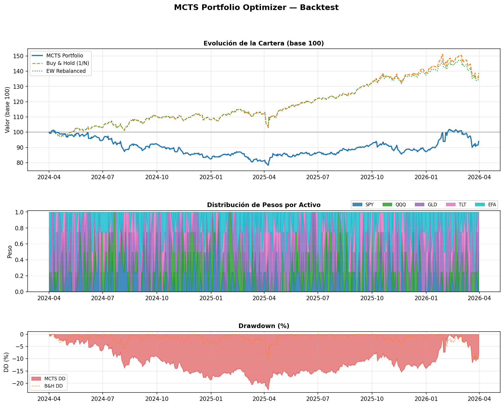

# Resultados del Backtest — MCTS Portfolio Multi-Activo

> Generado el 2026-03-31 19:18

## Configuración

| Parámetro | Valor |
|---|---|
| Tickers | `SPY | QQQ | GLD | TLT | EFA` |
| Período | `2y` |
| Sesiones | `502` |
| Granularidad | `1/4 (70 acciones)` |
| Iteraciones MCTS | `300` |
| Horizonte rollout | `20 días` |
| Ventana rolling | `60 días` |
| Capital inicial | `10,000 $` |
| Coste transacción | `0.1% turnover` |
| Prog. Widening | `k_w=2.0, alpha_w=0.5` |
| Semilla RNG | `42` |

## Resultados financieros

| Métrica | MCTS | Buy & Hold (1/N) | EW Rebalanced |
|---|---|---|---|
| Valor final [$] | 9,392.98 | 13,893.79 | 13,715.27 |
| ROI acumulado | -6.07% | +38.94% | +37.15% |
| Retorno anual | -3.09% | +17.95% | +17.19% |
| Sharpe | -0.4239 | 1.0086 | 0.9846 |
| Sortino | -0.5733 | 1.3242 | 1.3496 |
| Max Drawdown | -22.71% | -10.32% | -10.44% |
| Calmar | -0.1363 | 1.7389 | 1.6456 |

## Notas metodológicas

- **Espacio de acciones:** símplex discretizado (pesos con paso `1/granularity`, suma = 1).
- **Progressive Widening:** `max_children = ceil(k_w * n^alpha_w)` para controlar branching.
- **Rollout:** GBM multivariado con Cholesky, calibrado con ventana rolling.
- **Sin lookback bias:** la expansión usa retornos GBM simulados, no precios reales futuros.
- **Costes de transacción:** proporcionales al turnover de pesos.

