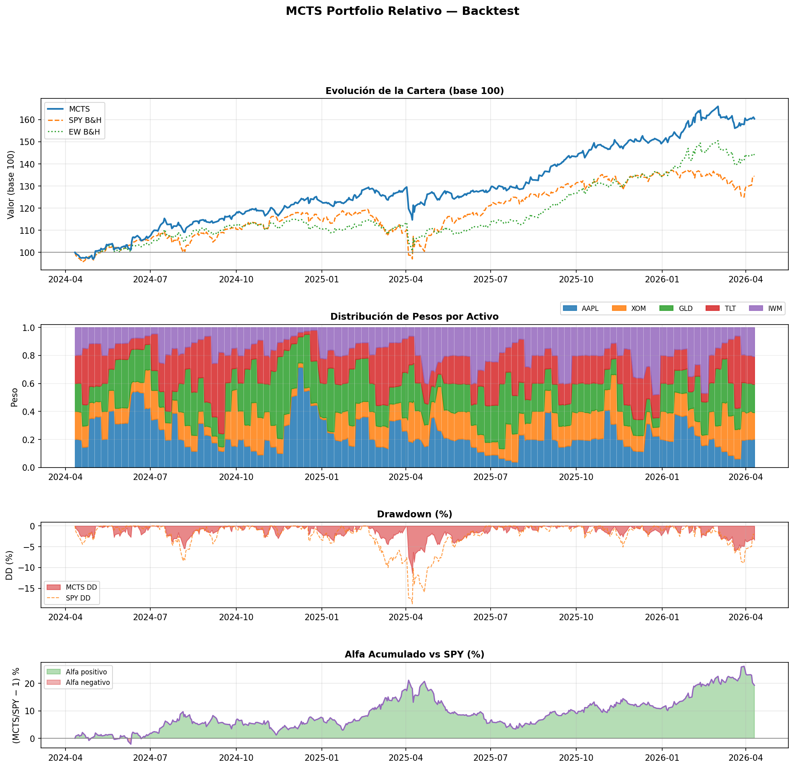
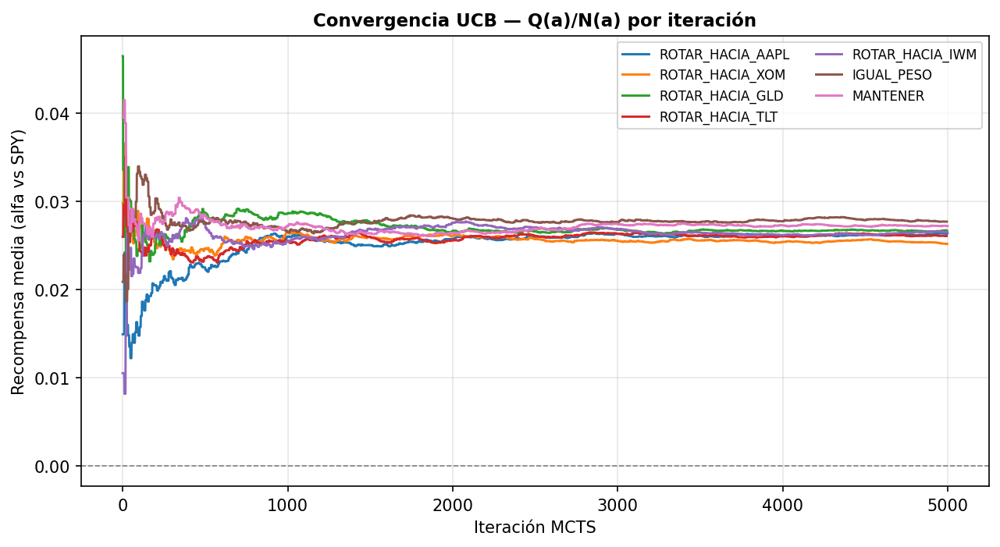

# Resultados del Backtest — MCTS Portfolio Relativo

> Generado el 2026-04-11 11:43

## Configuración

| Parámetro | Valor |
|---|---|
| Activos | `['AAPL', 'XOM', 'GLD', 'TLT', 'IWM']` |
| Benchmark | `SPY` |
| Período | `2y` |
| Capital inicial | `$10,000` |
| Iteraciones MCTS | `5000` |
| Días rollout | `20` |
| Ventana calibración | `60` |
| Trayectorias GBM | `20` |
| Tilt por rotación | `20%` |
| Coste transacción | `0.1%` |
| Frecuencia rebalanceo | `cada 5 días` |

## Resultados financieros

| Métrica | MCTS | SPY B&H | EW B&H |
|---|---|---|---|
| Valor final ($) | 16,034.94 | 13,436.22 | 14,397.52 |
| ROI acumulado | +60.35% | +34.36% | +43.98% |
| Retorno anual | +26.81% | +16.02% | +20.12% |
| Sharpe | 1.5419 | 0.7033 | 1.1184 |
| Sortino | 2.1356 | 0.9102 | 1.4752 |
| Max Drawdown | -11.44% | -18.76% | -13.10% |
| Calmar | 2.3429 | 0.8540 | 1.5358 |

## Distribución de acciones tomadas

| Acción | Veces |
|---|---|
| IGUAL_PESO | 26 |
| ROTAR_HACIA_AAPL | 16 |
| ROTAR_HACIA_TLT | 14 |
| ROTAR_HACIA_GLD | 13 |
| MANTENER | 12 |
| ROTAR_HACIA_IWM | 11 |
| ROTAR_HACIA_XOM | 8 |

## Notas metodológicas

- **Espacio de acciones**: 7 acciones semánticas (ROTAR_HACIA_i × N + IGUAL_PESO + MANTENER).
- **Recompensa relativa**: `E[log(1+ret_cartera)] − E[log(1+ret_SPY)]` → aprende a superar al índice.
- **GBM multivariado**: calibración rolling con Cholesky, SPY incluido como activo N+1.
- **Rebalanceo semanal**: cada 5 días para reducir costes de transacción.
- **Drift de pesos**: entre rebalanceos, los pesos evolucionan con el mercado (sin coste).

