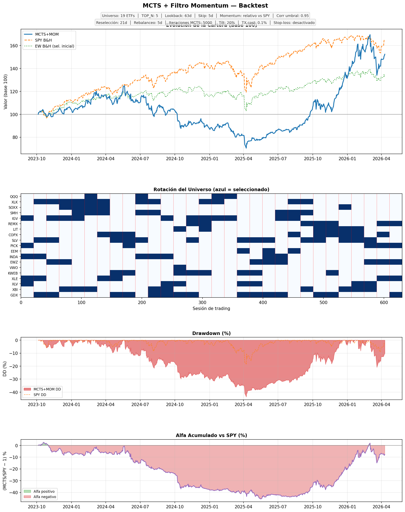
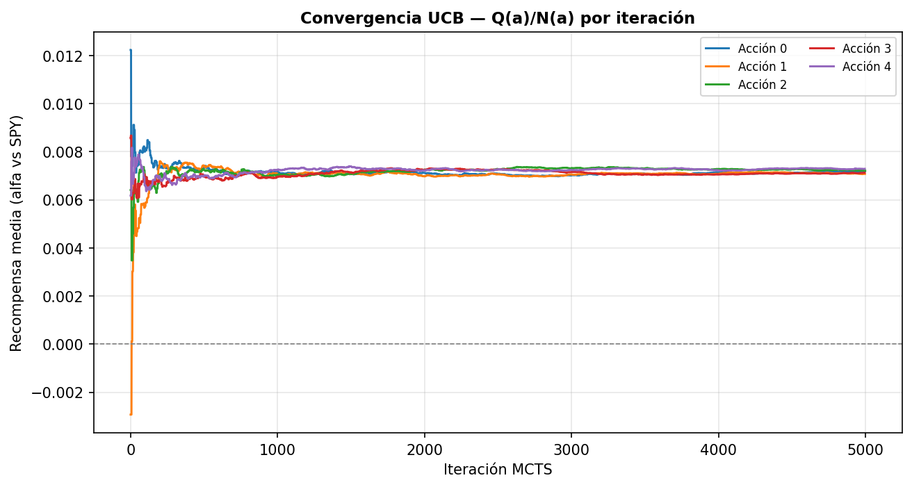

# Resultados — MCTS + Filtro Momentum Ajustado por Volatilidad

> Generado el 2026-04-11 10:05

## Configuración

| Parámetro | Valor |
|---|---|
| Universo amplio | `19 ETFs` |
| Activos seleccionados/mes | `5` |
| Lookback momentum | `63 días (~3 meses)` |
| Skip-month | `5 días` |
| Max por categoría | `5` |
| Umbral correlación | `0.95` |
| Renovación universo | `cada 21 días (~mensual)` |
| Stop-loss DD | `-99%` |
| Stop-loss cash | `50%` |
| Reentrada DD | `-15%` |
| Benchmark | `SPY` |
| Período datos | `3y` |
| Capital inicial | `$10,000` |
| Iteraciones MCTS | `5000` |
| Días rollout | `20` |
| Ventana calibración GBM | `60` |
| Trayectorias GBM | `50` |
| Tilt por rotación | `20%` |
| Coste transacción | `0.1%` |
| Frecuencia rebalanceo MCTS | `cada 5 días` |

## Resultados financieros

| Métrica | MCTS+MOM | SPY B&H | EW B&H |
|---|---|---|---|
| Valor final ($) | 15,242.48 | 16,513.29 | 13,259.37 |
| ROI acumulado | +52.42% | +65.13% | +32.59% |
| Retorno anual | +18.36% | +22.22% | +11.95% |
| Sharpe | 0.6122 | 1.0648 | 0.5526 |
| Sortino | 0.8051 | 1.3935 | 0.7259 |
| Max Drawdown | -43.66% | -18.76% | -17.36% |
| Calmar | 0.4207 | 1.1846 | 0.6882 |

## Distribución de acciones MCTS

| Acción | Veces |
|---|---|
| IGUAL_PESO | 19 |
| MANTENER | 15 |
| ROTAR_HACIA_SLV | 12 |
| ROTAR_HACIA_INDA | 9 |
| ROTAR_HACIA_IGV | 8 |
| ROTAR_HACIA_XLK | 8 |
| ROTAR_HACIA_COPX | 7 |
| ROTAR_HACIA_EWZ | 6 |
| ROTAR_HACIA_GDX | 6 |
| ROTAR_HACIA_SMH | 5 |
| ROTAR_HACIA_LIT | 5 |
| ROTAR_HACIA_XLE | 4 |
| ROTAR_HACIA_REMX | 4 |
| ROTAR_HACIA_XBI | 3 |
| ROTAR_HACIA_SOXX | 3 |
| ROTAR_HACIA_KWEB | 3 |
| ROTAR_HACIA_QQQ | 3 |
| ROTAR_HACIA_XLV | 2 |
| ROTAR_HACIA_EEM | 2 |
| ROTAR_HACIA_PICK | 2 |

## ETFs más seleccionados por el filtro momentum

| ETF | Veces seleccionado |
|---|---|
| GDX | 15 |
| SLV | 14 |
| XLK | 12 |
| IGV | 11 |
| XBI | 9 |
| COPX | 9 |
| EWZ | 8 |
| SMH | 8 |
| KWEB | 8 |
| INDA | 7 |
| XLV | 7 |
| REMX | 7 |
| XLE | 6 |
| LIT | 6 |
| PICK | 5 |
| SOXX | 5 |
| QQQ | 4 |
| EEM | 3 |
| VWO | 1 |

## Notas metodológicas

- **Etapa 1 — Filtro momentum con skip-month**: cada mes se seleccionan los TOP_N ETFs con mayor
  `retorno_log_acumulado(t-63, t-5) / volatilidad_anualizada`.
  El skip-month excluye el último mes para evitar reversión a la media (Jegadeesh & Titman).
- **Diversificación forzada**: máx 2 ETFs por categoría + correlación < 0.85 entre seleccionados.
- **Etapa 2 — MCTS relativo con opción CASH**: rota semanalmente entre los activos seleccionados,
  optimizando `E[log(1+ret_cartera)] − E[log(1+ret_SPY)]`. Incluye acción IR_A_CASH.
- **Stop-loss dinámico**: si DD < -99%, fuerza 50% a cash.
  Reentrada cuando DD > -15%. Eventos de stop-loss: 0.
- **Re-mapeo de pesos**: al cambiar universo, los activos que permanecen conservan
  su peso; los nuevos reciben el peso proporcional de los que salen.

