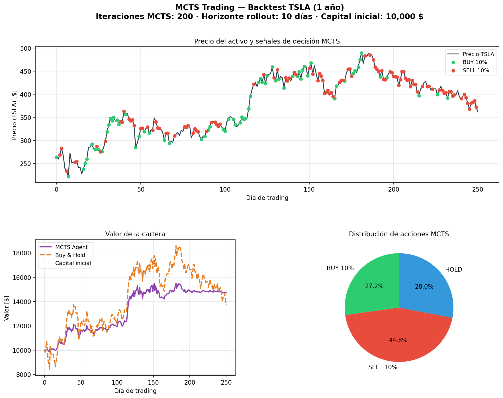

# Resultados del Backtest — MCTS Trading

> Generado el 2026-03-28

## Configuración del experimento

| Parámetro            | Valor          |
|----------------------|----------------|
| Activo (ticker)      | `TSLA`     |
| Período              | 1y       |
| Sesiones analizadas  | 251 días  |
| Iteraciones MCTS     | 200   |
| Horizonte rollout    | 10 días |
| Capital inicial      | 10,000.00 $ |

## Resultados financieros

| Métrica              | MCTS Agent     | Buy & Hold     |
|----------------------|----------------|----------------|
| Valor final [$]      |      14,714.88 |      13,729.08 |
| ROI acumulado        |       +47.15% |       +37.29% |
| Ratio de Sharpe      |         1.8139 | —              |

## Distribución de decisiones MCTS

| Acción   | Veces | % del total |
|----------|-------|-------------|
| BUY 10%  |    68 |      27.2% |
| SELL 10% |   112 |      44.8% |
| HOLD     |    70 |      28.0% |

## Notas metodológicas

- **Modelo estocástico:** Movimiento Browniano Geométrico (GBM) con solución exacta.
- **Calibración:** μ y σ estimados con ventana rolling de 20 días de log-rentabilidades.
- **Exploración UCB1:** constante c = √2 (estándar teórico).
- **Rollout:** media de 50 trayectorias GBM paralelas por simulación.
- **Reproducibilidad:** semilla fija `rng_seed=42` en todo el experimento.

## Gráfico

